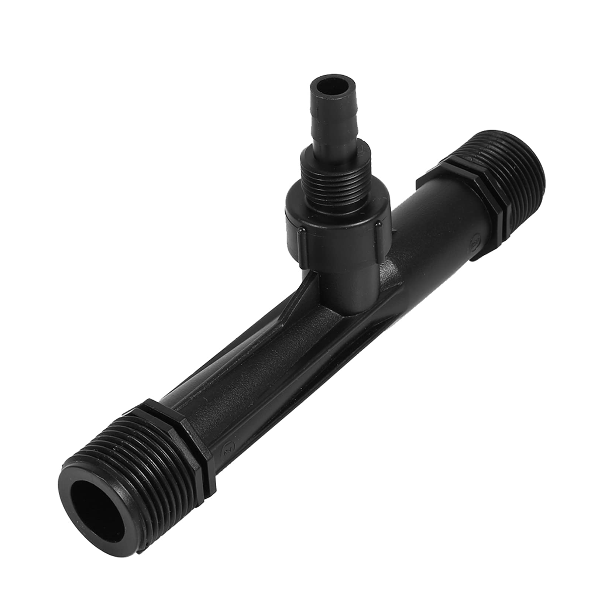
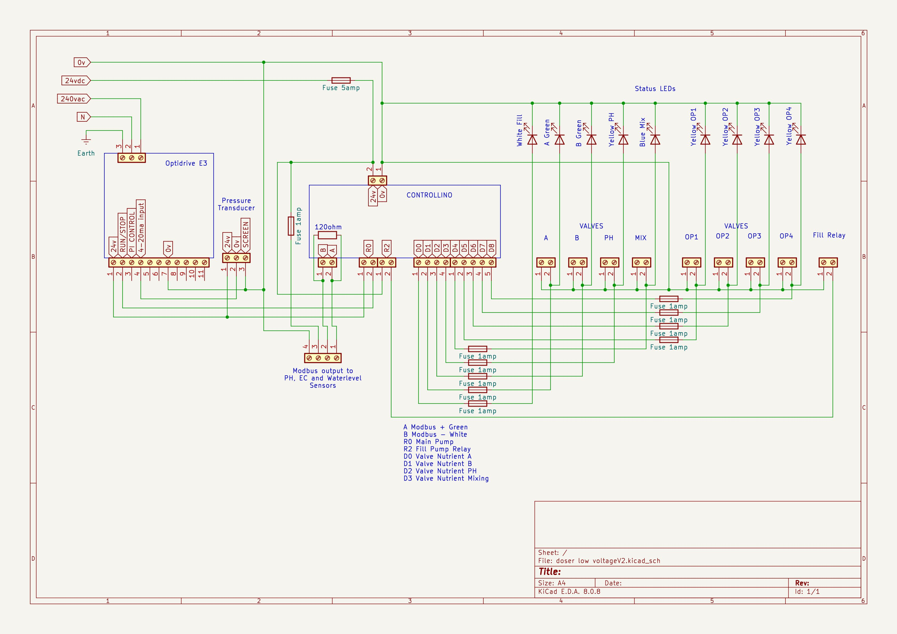
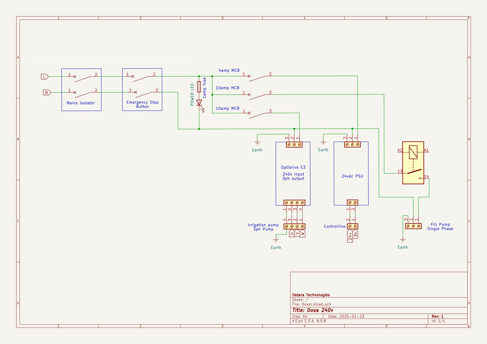

# Nutrient dosing system

 
A nutrient dosing system, also known as a fertigation system, is a vital piece of technology for any commercial growing operation that uses hydroponics, aeroponics  or other soilless growing methods. The systems automatically mix and deliver a precise nutrient solution to plants, eliminating manual labor, optimizing plant health, and maximizing yields.

## Problem 

A commercial grower was facing challenges with precise nutrient fertigation control in their greenhouses. Inconsistent dosing led to crop performance issues and created a major barrier to scaling up production.

## So how does it work?

The system continuously monitors the water’s electrical conductivity (EC) and pH using specialized sensors. Based on a preset recipe, the controller determines whether additional nutrients are required.

If EC or pH levels fall outside the desired range, the system activates. Solenoid valves connected to Venturi injectors open for a set duration (e.g., 2.5 seconds), allowing nutrient concentrates to be dosed into the line. The nutrient ratios—such as a 50:50 mix of Part A and Part B, or a 30:70 mix—are determined by the head growers according to crop requirements.

Water is drawn from a 2,000-liter holding tank and circulated through the fertigation loop by a pump. The water passes through a particulate filter and into the loop, where solenoid-controlled Venturi injectors add nutrients (Parts A, B, and pH adjusters). At a flow rate of 10 L/min, the Venturis draw approximately 25 mL of nutrient per second. A bypass line ensures thorough mixing when the solenoids are engaged.

The system maintains a constant circulation rate and pressure. The pump delivers 4 bar of pressure, monitored by a 0–10 bar pressure transducer with a 4–20 mA output. An Optidrive controller places the pump into standby mode when pressure stabilizes at 4 bar with no flow and restarts it automatically if pressure drops to 3.8 bar.

Once the nutrient concentration is correct, the system remains in standby to conserve energy. At preset intervals, output solenoids open, prompting the pump to resume operation and deliver nutrient solution to the greenhouse drippers at 4 bar. The delivery continues for a specified duration or until the main tank is empty.

A water level sensor in the holding tank shuts down the system if the water level is too low, activating an automatic refill valve to maintain a constant volume. The Hudson valve ensures the tank is topped up as needed. After refilling, circulation resumes and the system re-checks EC and pH every 10 minutes, adjusting as required.

## Flow rates and venturti valves.

During the testing phase, several different sizes of Venturi valves were used. Initially, some of these valves pulled in far too much nutrient solution, causing massive swings in EC and pH. This made it impossible to maintain the correct values without significantly overshooting the set points.

After allot of testing, it was discovered that using a smaller Venturi valve in combination with a constant flow valve, set at 10 liters per minute, provided precise control. This specific setup consistently pulled in 25 ml of nutrient per second, allowing the system to accurately manage and maintain the desired nutrient levels.

## Sensors

All sensors (pH, EC, water level, etc.) communicate using the MODBUS RS485 protocol.

Water temperature has a significant impact on both EC and pH measurements. To ensure accuracy, sensors for both parameters are equipped with Automatic Temperature Compensation (ATC), which adjusts readings to a standard reference temperature of 25 °C.

EC (Electrical Conductivity): As temperature increases, ions in the solution move more quickly, which raises the solution’s ability to conduct electricity and results in a higher EC reading. Conversely, colder temperatures reduce ion mobility and lower the reading. ATC corrects for these fluctuations by normalizing measurements to 25 °C.

pH: Temperature influences pH in two ways. First, it changes the voltage output of the pH sensor. Second, it alters the chemical equilibrium of the water itself, increasing the concentration of hydrogen ions as the solution warms. ATC compensates for the sensor’s voltage variations, producing more consistent and reliable measurements.

## Electrical enclosure

The electrical enclosure contains the Optidrive for motor control, along with all circuit breakers and the main microcontroller.

* The main panel includes:
* A mains isolator switch
* An emergency stop switch
* A three-way selector switch to set the pump to Manual, Automatic, or Off mode
* LED indicators to display system status, including mains power availability and solenoid valve activation

 

System make up:

* Constant pressure pump
* Venturi injectors
* Solenoid valves
* Pressure transducer
* Partculate filetrs
* Ph sensor
* Ec ennsor
* Optidrive E3
* controllino microcontroller

 

## Testing

After the initial setup, we began a trial-and-error process to find the right flow rates and venturi settings. We quickly discovered that a smaller venturi provided much better control over nutrient delivery.

Adjusting the Optidrive settings was also a challenge. However, once the correct settings were found, the pump would shut down, and the system would maintain its pressure. It also recovered quickly whenever a valve was opened.

To monitor the system's performance, I used MQTT to track the EC and pH probes, allowing me to see how fast the system reached its target setpoints. 

The test was performed with 200 liters of water to evaluate the system's ability to adjust water quality. Since the local water is hard, a nutrient mixture and a pH down solution were used.

Initial Water Conditions:
* pH: 7.8
* EC: 0.3

Target Setpoints:
* pH: 6.2
* EC: 1.5

Performance:

The system successfully reached its target setpoints in approximately 20 minutes. The venturi opening time was calculated at 2 seconds to achieve the desired results. The system performed batter than expected.